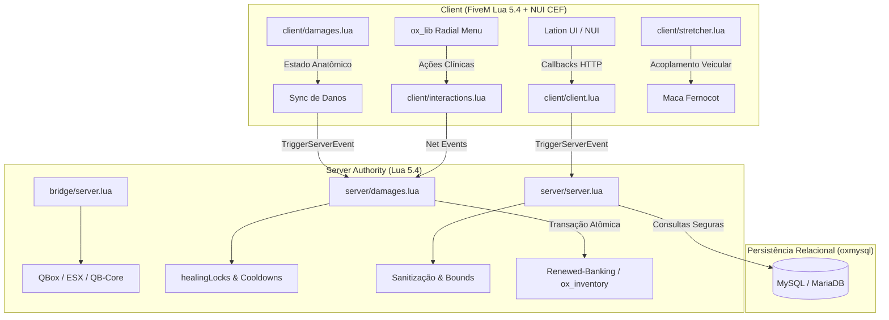

# 🏛️ Arquitetura do Sistema - Loki Medical Suite v2.5.0

Este documento descreve detalhadamente o design técnico, fluxo de dados cliente/servidor, fronteiras de confiança, persistência e gerenciamento de estado do **Loki Medical Suite**.

---

## 📐 Visão Geral da Arquitetura

O sistema é construído sobre uma **arquitetura orientada a serviços e autoridade estrita do servidor**, integrando módulos clínicos, farmacológicos, de suporte de vida e de perícia em um único ecossistema coordenado.

---

## 🔒 Princípios de Segurança e Autoridade

1. **O Cliente Propõe, o Servidor Decide:**
   - Nenhuma cura, restauração de vida, remoção de projétil, ressuscitação ou entrega de medicamento ocorre por ordem direta do cliente.
   - O servidor verifica permissões de trabalho (`GetPlayerJob`), proximidade física 3D (`dist <= maxDist and zDiff <= 3.5`), posse de itens necessários (`HasItem`) e capacidade de carga no inventário (`CanCarryItem`).

2. **Atomicidade e Fail-Closed:**
   - Todo side effect destrutivo (cobrança bancária ou remoção de insumo do inventário) é executado **antes** da concessão do benefício (aplicação da bandagem, entrega do remédio, alta médica).
   - Se a remoção falhar por qualquer motivo, o processo é abortado imediatamente sem alterar o estado do paciente ou médico.

3. **Mutex de Concorrência & Anti-Dupe:**
   - Tabelas de estado volátil (`healingLocks[targetPlayerId]` e `activeRedeems[source]`) garantem que um mesmo paciente ou balcão de farmácia não processe duas requisições simultâneas oriundas de flood de pacotes de rede.

4. **Separação Rígida de Clock Domains:**
   - Relógios de tempo do servidor (`os.time()`) são estritamente isolados dos contadores de tick do cliente (`GetGameTimer()`), prevenindo manipulação de timestamps de validade de receitas e atestados.

---

## 📂 Mapeamento dos Módulos Principais

| Módulo | Arquivos Client | Arquivos Server | Função Principal |
| :--- | :--- | :--- | :--- |
| **Prescrições & Farmácia** | `client/client.lua` | `server/server.lua` | Emissão de receitas médicas, validação em farmácias, recargas de uso contínuo e depósito institucional. |
| **Danos & Anatomia** | `client/damages.lua` | `server/damages.lua` | Monitoramento de ossos, fraturas, sangramento, suturas, queimaduras e extração de projéteis. |
| **Desfibrilador (AED)** | `client/defibrilator.lua` | `server/defibrilator.lua` | Choque elétrico bifásico sincronizado com áudio 3D e reanimação de parada cardiorrespiratória. |
| **Compressor Lucas 3** | `client/lucas3.lua` | `server/lucas3.lua` | Implante mecânico de prop no tórax do paciente para massagem contínua durante transporte. |
| **Maca Articulada** | `client/stretcher.lua` | `server/stretcher.lua` | Maca Fernocot com sincronização de transporte, colocação e acoplamento em ambulâncias. |
| **Radiologia (Raio-X)** | `client/xray.lua` | `server/xray.lua` | Diagnóstico por imagem fluoroscópica com visualizador CRT Lation UI. |
| **Perícia Balística** | `client/forensics.lua` | `server/forensics.lua` | Análise balística, identificação de calibres e teste de resíduos de disparo (GSR). |
| **Atestados Médicos** | `client/medical_certificate.lua` | `server/medical_certificate.lua` | Emissão e registro persistente de licença médica e atestado de afastamento. |
| **Sedação & Nocaute** | `client/sedative.lua` `client/knockout.lua` | `server/sedative.lua` | Aplicação de sedativo com seringa clínica e sistema de nocaute não-letal em combate desarmado. |
| **Auxiliares de Marcha** | `client/crutch.lua` `client/wheelchair.lua` | `server/crutch.lua` `server/wheelchair.lua` | Muletas ortopédicas com animação de mancar e cadeira de rodas articulada para pacientes em recuperação. |

---

## 🌐 Comunicação de Rede & Net Events

### Eventos do Servidor (Invocados pelo Cliente)
- `loki_prescriptions:createPrescription (payload, targetServerId)`
- `loki_prescriptions:redeemPrescription (data, pharmacyIndex)`
- `loki_prescriptions:buyInsurance ()`
- `loki_prescriptions:treatPlayer (targetServerId, actionData)`
- `loki_prescriptions:applyCPR (targetServerId)`
- `loki_prescriptions:syncLucas (targetServerId, state)`
- `loki_prescriptions:requestXRay (targetServerId)`
- `loki_prescriptions:issueCertificate (targetServerId, days, reason)`
- `loki_prescriptions:applySedative (targetServerId)`

### Eventos do Cliente (Disparados pelo Servidor)
- `loki_prescriptions:syncDamages (damagesTable)`
- `loki_prescriptions:clientTreatEffect (actionType, boneIndex)`
- `loki_prescriptions:playDefibSound (coords, soundName)`
- `loki_prescriptions:openXRayUI (patientData)`
- `loki_prescriptions:oxNotify (heading, msg, type)`

---

## 🧹 Coleta de Lixo & Ciclo de Vida do Jogador

Para assegurar **0.00ms de resmon** e evitar vazamentos no coletor de lixo Lua:
- Ao desconectar (`playerDropped`), todos os registros em `activeRedeems`, `healingLocks`, `healCooldowns`, `cprCooldowns` e instâncias de macas/Lucas 3 são purgados imediatamente pelo servidor.
- Entidades criadas no cliente (props de prancheta, muleta, cadeira de rodas, seringa) são anexadas à limpeza de recursos via `AddEventHandler('onResourceStop')`.
