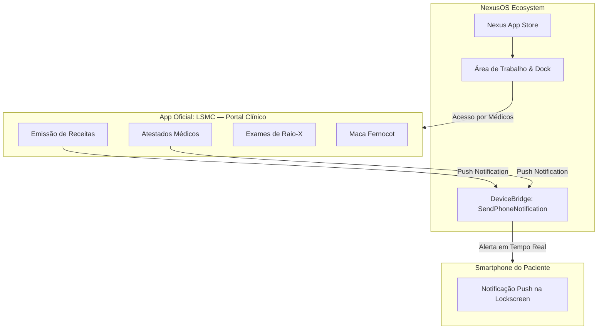

# 🌐 Integrações de Ecossistema: vp_needs & NexusOS

O **Loki Medical Suite v2.5.0** foi projetado para interoperabilidade nativa com os dois maiores pilares de gameplay da base: o motor fisiológico/metabólico **`vp_needs`** e o sistema operacional unificado **`nexus_os`**.

---

## 🧬 1. Integração Fisiológica & Metabólica com `vp_needs`

A integração clínica com o [`vp_needs`](../vp_needs) atua diretamente nos estados biológicos do jogador, permitindo que tratamentos hospitalares e medicamentos alterem condições reais de saúde e dependência.

### Ações & Efeitos Automáticos

```mermaid
graph LR
    subgraph Loki ["Loki Medical Suite"]
        Pill[Medicamentos Controlados]
        Syr[Seringa de Sedativo]
        Blood[Bolsa de Sangue]
        ToxCmd[/vertoxicologia]
    end

    subgraph VP ["vp_needs Engine"]
        Stress[Estresse & Ansiedade]
        Addict[Dependência Química]
        Sick[Enfermidade / Sickness]
        StateBag[StateBag: toxicity / bac / isOverdosing]
    end

    Pill -->|RelieveStress / AdjustNeed| Stress
    Pill -->|TreatAddiction| Addict
    Pill -->|AdjustNeed 'sickness'| Sick
    Syr -->|Sedação Profunda -70 Estresse| Stress
    Blood -->|Restauração de Volemia / Thirst| VP
    ToxCmd -->|Leitura de Estado| StateBag
```

### 1.1 Farmacologia Integrada (`Config.Medicine`)
- **Alívio de Estresse:** Medicamentos como Paracetamol, Ibuprofeno e Alprazolam (`med_xanax`) disparam `exports.vp_needs:RelieveStress()`, reduzindo a barra de estresse e neutralizando tremores de mira.
- **Tratamento de Doenças:** Antibióticos (Amoxicilina) e antivirais curam infecções ativas (`exports.vp_needs:AdjustNeed(src, 'sickness', -amount)`).
- **Tratamento de Vícios:** Medicamentos controlados de desmame auxiliam no tratamento gradual de dependências químicas (`exports.vp_needs:TreatAddiction()`).
- **Supressão de Sintomas:** Medicamentos específicos interrompem crises de asfixia/tosse do módulo `consumption_choking` e neutralizam enjoo e vômitos gástricos.

### 1.2 Sedativo Clínico Injetável (`sedative`)
- Ao aplicar a seringa de sedativo no paciente agitado ou em surto psicótico, o script aciona `VpNeedsBridge.ApplySedation(target)`, reduzindo **70 pontos de estresse** de forma imediata e interrompendo crises de abstinência severa.

### 1.3 Hemoterapia & Choque Hipovolêmico (`blood_bag`)
- Transfusões de sangue realizadas por socorristas restauram a volemia sanguínea e recuperam parâmetros críticos de hidratação e pressão arterial no `vp_needs`.

### 1.4 Exame Toxicológico & Triagem de Overdose
- Médicos e socorristas contam com o comando `/vertoxicologia [id]`:
  - Lê em tempo real as propriedades de StateBag do `vp_needs`:
    - `toxicity`: Nível de intoxicação por substâncias ilícitas (0 a 100%).
    - `bac`: Alcoolemia no sangue em g/L.
    - `isOverdosing`: Se o paciente está em estado de colapso respiratório/cardíaco por overdose.
  - Se detectada overdose, o sistema alerta o médico com prioridade para realização de lavagem gástrica (`/stomachpump`) ou administração de Naloxona.

---

## 🖥️ 2. Integração Operacional com `NexusOS`

O **NexusOS** (`nexus_os`) é o sistema operacional presente nos computadores e notebooks portáteis do servidor. O **Loki Medical Suite** conecta-se a ele em duas frentes fundamentais:



### 2.1 Aplicativo Oficial "LSMC — Portal Clínico"
- Registrado automaticamente na **App Store**, no **Desktop** e na barra de tarefas do NexusOS via `exports['nexus_os']:RegisterApp()`.
- **Restrição de Acesso:** Exclusivo para funcionários do departamento de emergência médica (`ambulance`, `doctor`).
- **Recursos Disponíveis no App:**
  1. 📝 **Bloco de Receituário Médico:** Abre a interface digital Lation UI com prancheta de emissão rápida de medicamentos controlados.
  2. 📜 **Emissão de Atestado Médico:** Homologação de licença médica e atestado de dispensa laboral.
  3. 🩻 **Centro Radiográfico:** Inicialização de exame fluoroscópico por Raio-X com feixe CRT.
  4. 🔬 **Avaliação Toxicológica:** Aferição de substâncias e alcoolemia integrada ao `vp_needs`.
  5. 🚑 **Logística Pré-Hospitalar:** Requisitar ou recolher maca Fernocot.

### 2.2 Notificações Push no Smartphone do Cidadão
Quando um procedimento é homologado, o servidor aciona `NexusBridge.SendNotification()` que despacha notificações push diretamente para o celular do paciente:
- **Receita Emitida:** O paciente recebe no celular o alerta *"LSMC Farmácia: Nova receita emitida pelo Dr(a). [Nome do Médico]. Retire seus medicamentos em qualquer unidade."*
- **Atestado Homologado:** O paciente recebe *"LSMC Departamento Médico: Seu atestado médico de X dia(s) foi homologado."*
- Caso o smartphone do jogador não esteja com o aplicativo aberto, o sistema converte automaticamente o alerta em notificação flutuante de alta prioridade via `ox_lib`.

---

## 🔧 Como Testar e Validar as Integrações em Jogo

1. **Teste de Farmacologia (`vp_needs`):**
   - Consuma um medicamento (`med_paracetamol` ou `med_xanax`).
   - Observe a barra de estresse diminuir e os batimentos cardíacos estabilizarem.
2. **Teste de Toxicologia (`vp_needs`):**
   - Com um paciente próximo que ingeriu álcool ou substâncias, digite `/vertoxicologia [id]`.
   - O laudo exibirá os níveis de `toxicity`, `bac` e indicador de overdose.
3. **Teste no NexusOS (`nexus_os`):**
   - Abra um notebook portátil (`laptop`) ou computador de mesa em um hospital.
   - Abra a **App Store** ou localize o ícone **LSMC — Portal Clínico** no Desktop.
   - Clique para abrir a central de ações do corpo médico.
   - Emita uma receita médica mirando em um paciente e verifique o envio do push notification no celular dele!
