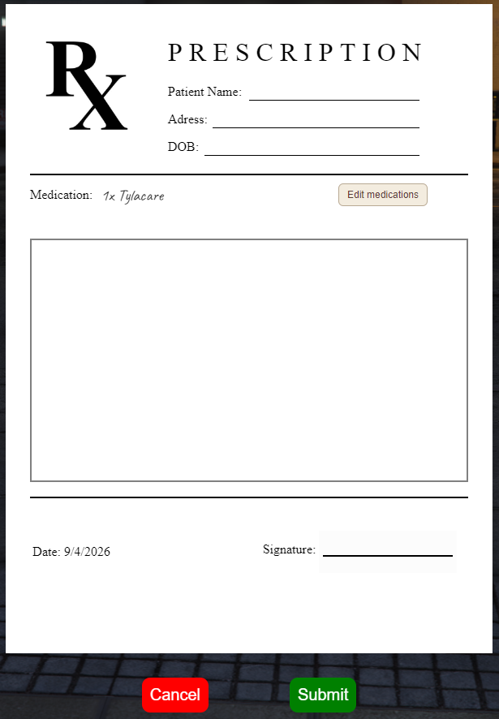
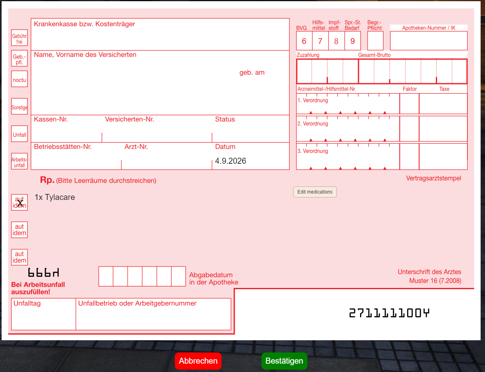
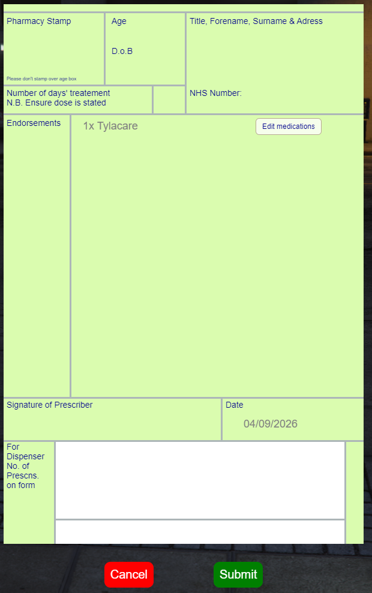
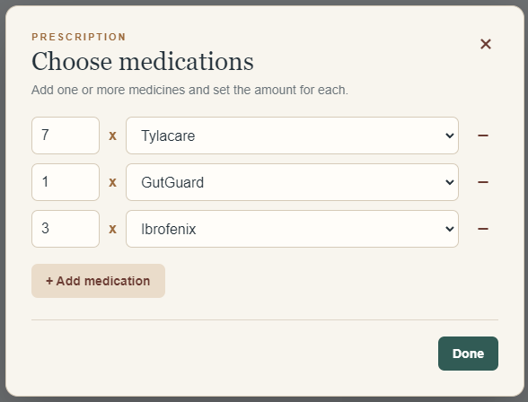

# LOKI_PRESCRIPTIONS

A FiveM Script that allows medical jobs to issue interactive prescriptions as items, which players can redeem at a pharmacy to receive their medication.
Includes 3 different realistic styles of prescriptions: US, UK, DE.

The Script features unique prescription items that players can view after a doctor issued them, as well as a health insurance system that can be manually integrated into other scripts by using the database table for it.

This Script was developed with [K_DISEASES](https://kbase.tebex.io/package/5509125) by [@kypo](https://github.com/gtasnail) in mind, but can also be used standalone.
Be aware that this Script does NOT include any functionality for taking the medicine items. If you want a Script like this, you probably already have a Script that handles taking the medicine.

This script was previously paid on Tebex but was now made open source and free.

Preview of the UI:

## Compatibility
The Script is natively compatible with popular frameworks, inventories and notification scripts. You can find all the integrations in `client/custom.lua` and `server/custom.lua`, as well as placeholders for adding support to your own Scripts.

### Framework
ESX, QBCore and QBox work out of the box.

### Inventory
Native integration for ox_inventory, qs-inventory and qb-inventory.

### Notifications
These notification scripts are supported, choose yours in `config.lua` :okokNotify, esx,ox_lib, RiP-Notify, qb-notify, wasabi_notify, mythic_notify, sy_notify

### Target
Target / Third eye is optional, but recommended as it's prettier. ox_target and qb-target are supported, but the script will fallback to showing a marker with a press E interaction when none of those are found.

## Install
Download the latest release from the release section, or clone the repository. If you clone the repository, you have to manually build the NUI from source, refer to [Building](./web/src/building.md) for more details.
Install the resource like any other: Unzip it in your resource folder.
Then open the config.lua and configure it to your liking. Remember to also add the prescription, prescription_pad and medicine items you configured to your inventory. The `ITEM_SETUP` folder includes some useful information for that.

## How to use
Using the script is pretty simple. Lets say you have k_diseases installed and configured the script so that doctors can issue prescriptions.
A player get's sick and goes to the doctor. After all the surrounding RP, the doctor can use the prescription_pad item (you will need to add a way to obtain it yourself), which opens a UI in your configured style. There the doctor chooses the medicine they want to prescribe including the amount, as well as some other information that is only relevant for RP like the patient name, date of birth and the doctor's signature. When the doctor submits that, they'll get a prescription item, which has unique metadata for the entered data attatched. Using that item shows all the details the doctor entered. The doctor can now give the prescription item to the patient. The patient now goes to a pharmacy. Either the pharmacy is configured as an NPC, where the player interacts and trades their prescription and money for the prescribed medicine. Alternatively, if you have a player based pharmacy, the player can hand over the prescription and the entire process can be handled through RP.

Optionally, a player can buy a health insurance (if configured), to reduce the cost of their medication, adding an additional layer of immersion.

## If you encounter any problems
Feel free to open an Issue or a PR if you notice anything not working or need help with anything. I'll try my best to help you.

TODO's:
* logs for creating and redeeming prescriptions
* preconfigure medicine items for qb
